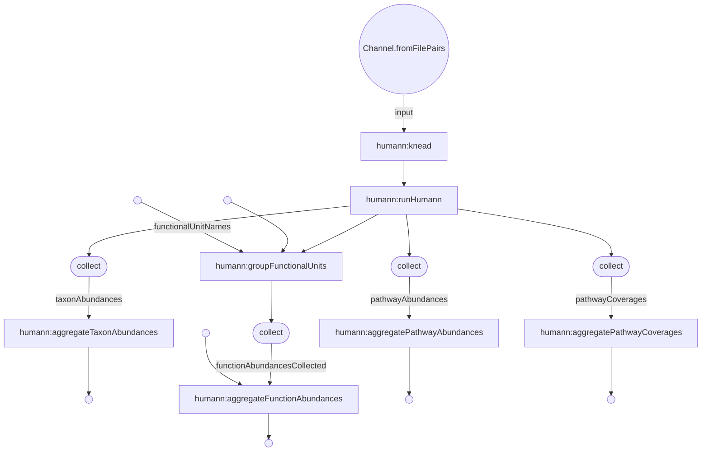

# Humann(+wget, kneaddata) in a Nextflow pipeline

***<p align=center>loadSingleExperiment</p>***  


Runs humann for a list of samples.

In:
- File of SRRIDS.tsv (format like data/sample-to-fastqs.tsv)

Out:
- species tables from metaphlan
- abundances of ECs and other functional units
- abundances of pathways
- coverages of pathways

## Overview
The fastqs are downloaded locally, trimmed ("kneaded") with `kneaddata`, and - if paired - merged together.
Then `humann` is ran on each input, with specified CPU and memory.
The results are merged and returned as a single file per result type.

## Install
* Install Nextflow
    `curl https://get.nextflow.io | bash`
* Install Docker

* Databases need to be installed and bound to the docker container
`docker run -it -d -v <path-to-dir-containing-chocophlan-uniref-and-utility_mapping-databases>:/humann_databases -v <path-to-kneaddata-databases>:/kneaddata_databases -v <path-to-dir-containing-metaphlanv31-database>:/usr/local/lib/python3.8/dist-packages/metaphlan/metaphlan_databases/ veupathdb/humann`

### Reference databases
HUMAnN and Kneaddata need reference databases.

* Uniref90
http://huttenhower.sph.harvard.edu/humann_data/uniprot/uniref_annotated/uniref90_annotated_v201901.tar.gz

* Uniref50
http://huttenhower.sph.harvard.edu/humann_data/uniprot/uniref_annotated/uniref50_annotated_v201901.tar.gz

* Chocophlan
http://cmprod1.cibio.unitn.it/biobakery3/metaphlan_databases/mpa_v31_CHOCOPhlAn_201901.tar

* utility_mapping
http://huttenhower.sph.harvard.edu/humann_data/full_mapping_v201901.tar.gz

* kneaddata
http://huttenhower.sph.harvard.edu/kneadData_databases/Homo_sapiens_hg37_and_human_contamination_Bowtie2_v0.1.tar.gz

* metaphlan_database
http://cmprod1.cibio.unitn.it/biobakery3/metaphlan_databases/mpa_v31_CHOCOPhlAn_201901.tar

### Choosing the reference protein set
`uniref50_diamond` might be more economical than `uniref90_diamond`.

In that case, modify or override `nextflow.config` as follows:
```
params {
  unirefXX = 'uniref50'
}
```

### Arguments to tools
You can provide custom installation paths or extra parameters as needed:
```
params {
  kneaddata --trimmomatic ~/lib/Trimmomatic-0.39
  humannCommand = "humann --memory-use maximum"
}
```

### Cluster submission
The most resource-intensive part of this pipeline is the job that runs HumAnN. It is labelled as `mem_4c`. To run it with 10GB (enough for the EC filtered UniRef90):
```
process {
  executor = 'lsf'
  maxForks = 20
 
  withLabel: 'mem_4c' {
   clusterOptions = '-n 4 -M 10000 -R "rusage [mem=10000] span[hosts=1]"'
  }
}
```

Memory use for each job depends on the reference size, and input size. To retry failed jobs with more memory, you could modify the config as follows:

```
  withLabel: 'mem_4c' {
    errorStrategy = { task.exitStatus in 130..140 ? 'retry' : 'terminate' }
    maxRetries = 3
    clusterOptions = { task.attempt == 1 ?
      '-n 4 -M 12000 -R \"rusage [mem=12000] span[hosts=1]\"'
      : task.attempt == 2 ?
      '-n 4 -M 17000 -R \"rusage [mem=17000] span[hosts=1]\"'
      : '-n 4 -M 25000 -R \"rusage [mem=25000] span[hosts=1]\"'
    }
  }

```


## Output format
There's a file for taxa, pathway abundances, pathway coverages, and each functional unit specified in the config.

Each file is a TSV. The header contains the row type, followed by sample names. This is the same as the output of `humann_join_tables` script.

Taxa are in the same format, created by adjusting the usual Metaphlan output by removing the frontmatter and the NCBI id column.
